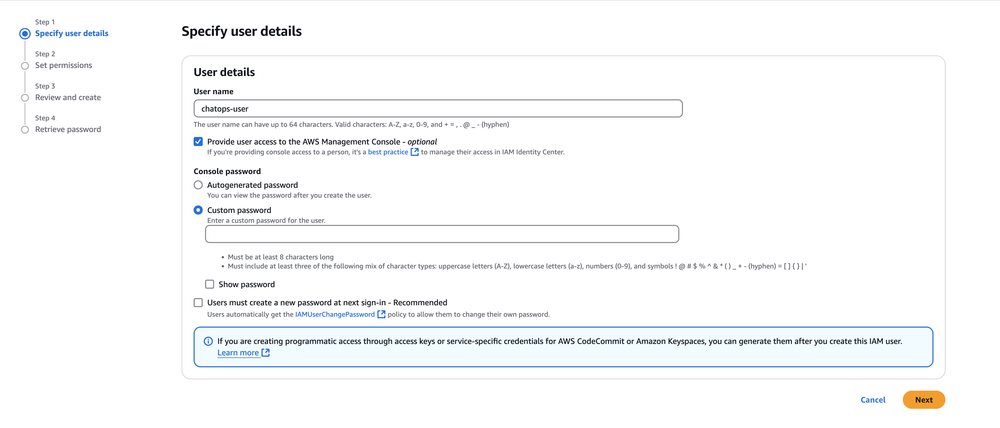
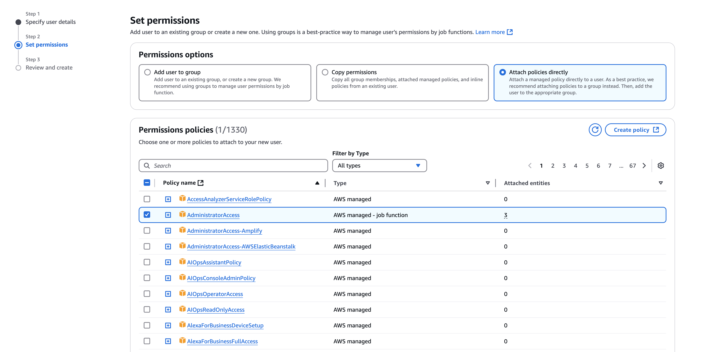
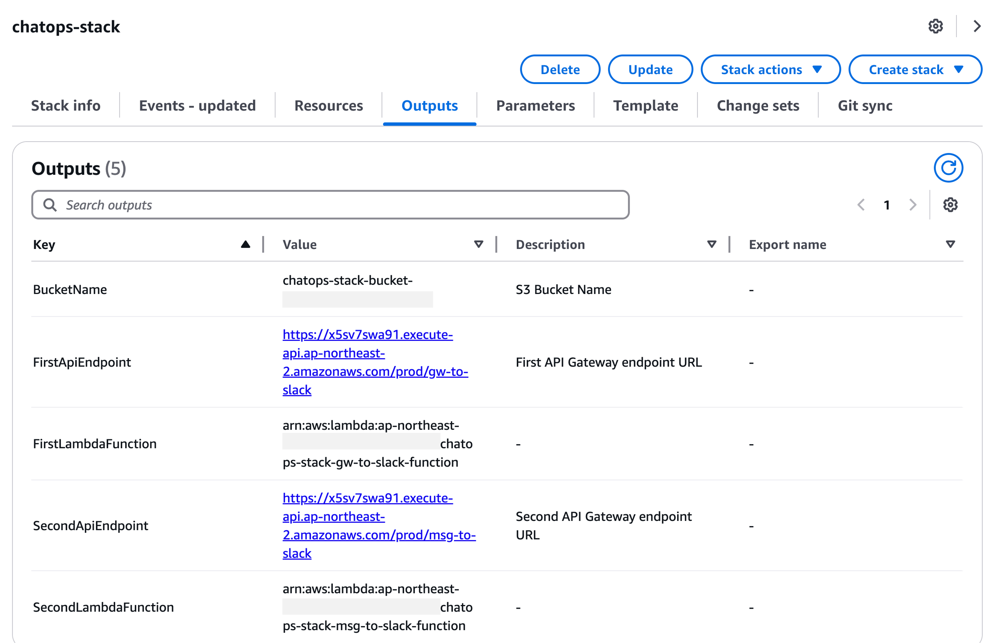

# IAM User 생성
1. AWS Console > IAM 이동합니다.

2. 왼쪽에 User 를 탭하고, 아래와 같이 콘솔접근 권한을 체크하고, 비밀번호 재설정 옵션은 해제합니다.



3. 권한은 아래와 같이 직접 권한 추가를 선택하고, AdministratorAccess 권합을 추가합니다.



4. AWS Console을 2번에서 생성한 user 계정으로 재접속합니다. (Account ID 기억해둘 것)

# CloudFormation 실행 방법

1. AWS Console > Cloudshell 실행합니다.

2. Workshop 코드를 다운로드 합니다.
```
git clone https://github.com/kjhyuok/genai-chatops.git
```

3. CloudFormation 실행합니다.
```
cd genai-chatops/cloudformation
chmod +x ./deploy.sh
./deploy.sh
```

# 실행 결과확인
1. AWS Console > CloudFormation 이동합니다.

2. chatops-stack 스택이 CREATE_COMPLETE 을 확인하고, Outputs 에서 API Gateway, S3 등 완성한 리소스를 확인할 수 있습니다.

